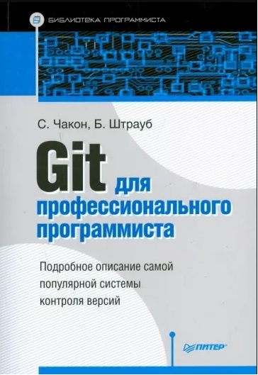

# Инструкция

>Что такое «система контроля версий» и почему это важно? Система контроля версий - это система, записывающая изменения в файл или набор файлов в течение времени и позволяющая вернуться позже к определённой версии. То есть шаг за шагом мы видим, какие файлы изменились и как. Особенно это важно, когда анализируешь, что было проделано в рамках одной задачи и это дает возможность возвращаться назад.

## Установка git и Visual Studio Code (VSC) и начало работы

Установка git для Windows, MAC, Linux: https://git-scm.com/downloads

Установка Visual Studio Code (VSC) для Windows, MAC, Linux: https://code.visualstudio.com/Download

1. После установки  необходимо «представиться» системе контроля версий GIT. Это нужно сделать всего один раз, и git запомнит вас. Для этого нужно запустить git  и в терминале git ввести две команды:

• git config --global user.name «Ваше имя английскими буквами»

• git config --global user.email ваша почта@example.com

2. Создать для работы папку в удобном месте, например на рабочем столе.

3. Запустить Visual Studio Code (VSC) предварительно создав на компьютере папку для работы.

4. Открываем созданную папку через VSC и уже работаем в VSC
Чтобы GIT начал контролировать то, что происходит в этой папке, помогал в работе, необходимо запустить команду в VSC. Это все можно сделать мышкой, но лучше ознакомиться с тем путем, с которым работают программисты.
Чтобы запустить терминал заходим в меню ВИД -> терминал
Программы, которыми пользуются программисты для своих целей являются консольными, т.е. они будут вызываться с помощью команд, которые будут набираться с помощью клавиатуры через терминал. 

5.	Поверим установлен и настроен Git или нет. Для этого наберем в терминале команду git –version чтобы посмотреть версию программы.

6. Чтобы Git  начал отслеживать все что происходит в созданной папке необходимо инициализировать Git для этого используем команду git init.  Все команды, которые используются в git и в терминалах они мнемонические, т.е. их легко запомнить.

*Основные команды git:*

git  init – инициализация локального репозитория

git status – получить информацию от  git о его текущем состояни

git add – добавить файл или файлы к следующему коммиту

git commit –m “message” – создание коммита

git log – вывод на экран истории всех коммитов с их хеш-кодами

git checkout – переход от одного коммита к другому

git checkout master – вернуться к актуальному состоянию и продолжить работу

git diff – увидеть разницу между текущим файлом и закоммиченным файлом

git branch 'здесь указывается имя ветки'- создание новой ветки

Подробная инструкция в лекциях, а также можно ознакомиться с книгой ["Git для профессионального программиста"](https://git-scm.com/book/ru/v2), авторов Бен Штрауб и Скотт Чакон 

